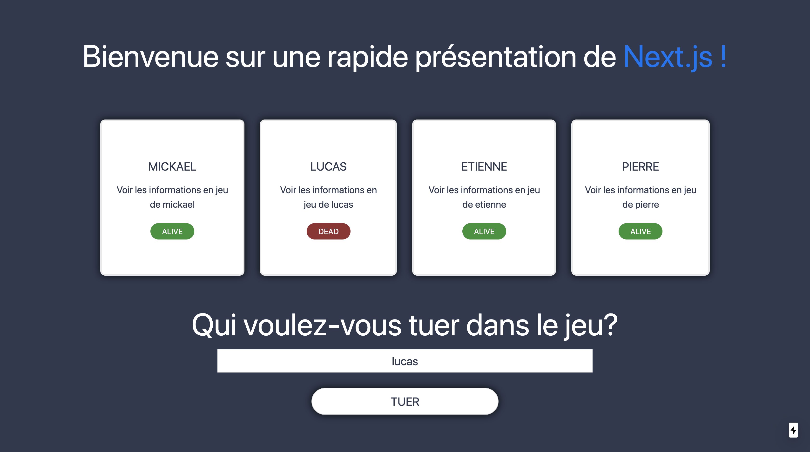

# Presentation Next js

Projet réalisé dans le cadre de l'unité d'enseignement Web Avancé et Web Mobile à l'université Claude Bernard Lyon 1, pour un exposé présentant la technologie Next Js

## Lancer le projet

Lancer le serveur de dévellopement :

```bash
npm run dev
# ou
yarn dev
```

Ouvrir [http://localhost:3000](http://localhost:3000) dans votre navigateur pour voir le résultat.

Vous pouvez commencer à travailler en modifiant le fichier `pages/index.js`. Le site s'auto-actualise quand vous enregistrez vos changement.
